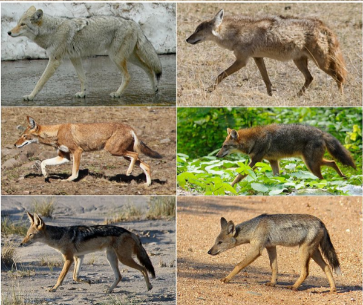

# Abstract

The number of extinct species of Canis have balanced the number of new species of Canis. There are an abundence of wolves, coyotes, dogs, and jackels have roamed the earth for many years. This data will further look into the Genus of 'Canis' to analyze the relationship to the wolves and coyotes we see in the wilderness to man's best friend. This domesticated species is quiet unusual since it only affects one specific subspecies. Fossil data will see the abundence of occurences of these *canis* genus and debunk this obsercation. 



\clearpage

# Introduction

*Canis* is a taxanomic genus of dogs, coyotes, jackals. Within this genus, each species is catagorized by the physical features each mammal has, such as their skull, limbs, and their size. The fossil occurence data in **PaleoBiology Database** (PBDB) identified the earliest known fossil found was around 23 million years ago. This fossil canis *edwardii* is one of the longest lasting species (22 million years) to roam the earth. This data, however, is limited by the collection from willing professional researchers and qualified graduate level-researchers. **PBDB** presented that there was a mass of 145 fossil occurrences that dated back to the Late Pleistocene and 115 fossil occurrences from the Irvingtonian. This is responsibile for the high number of canis **edwardii** fossils found during this era. 

The *Canis* genus was said to originate from North America, Europe, and Asia (Vila 1997). This is supported heavily in the United States Region and Europe. Before these countries came about, the Miocene Epoch allowed for the rise of more grassland (Arribas 2009). Since there was an increase of grazers in the area, this supported **canis** to thrive through the different time periods 

This project will demonstrate the variety of species in this **genus** that were found throughout time from 23 million years ago until today. We will understand how the environment affected the *canis* genus to help produce our domesticated dogs of today. 

# Methods 


```{r,echo=FALSE,message=FALSE,warning=FALSE}
require(knitr)
# Set so that long lines in R will be wrapped:
opts_chunk$set(tidy.opts=list(width.cutoff=40),tidy=TRUE)

```

## **Map of Fossil Records**
#### (R - Rstudio)
```{r, echo = T, eval = F}

library(ggplot2)
canis_lnglat <- read.csv("formatted-Canis_Occurences_lnglat_noheader.csv", header = F, as.is = T) #grab the .csv data 
colnames(canis_lnglat)<-c("species","accepted_rank","max_ma","min_ma","lng","lat")
# what the data columns are 
#define what is in the data 
head(canis_lnglat)

# first of all we needed to import a world map
library(ggplot2)
library(maps)

world_map <- map_data("world")

#make a base plot with gpplot2
p <- ggplot() + coord_fixed(ratio = 1) + xlab("") + ylab("")


#Add map to base plot
base_world_version1<- p + geom_polygon(data=world_map, aes(x=long, y=lat, group=group), colour="green ", fill="green")
# overlay lng and lat on base_map
map_data1 <- base_world_version1 + geom_point(data=canis_lnglat,aes(x=lng, y=lat), colour="Red",pch=2, size=0.1, alpha=I(1)) + labs(title = "Map: Fossil Records Canis", x = "Longitude", y = "Latitude") + theme(plot.title = element_text(hjust = 0.5, size=20, face = "bold"),   axis.title =element_text(size=12))


# INSERT MAP

map_data1

```

## **Bar Graph of Species**
#### (Python - ggplot)
```{r, echo = T, eval = F}

library(dplyr)
library(ggplot2)

## Assuming the data is in the file 'Types.csv'
canis_dat <- read.csv ("Canis_Occurances_725_header.csv", header = TRUE)

canis_dat_summary <-
    canis_dat            %>% # Pipe df into group_by
    group_by(accepted_name)      %>% # grouping by 'type' column
    summarise(name_count = n()) # calculate the name count for each group
## 'canis_dat_summary' now contains the summary data for each 'type'
canis_dat_summary


### Two ways to plot using ggplot

## (1) Plot pre summarized data: 'canis_dat_summary'.
ggplot(canis_dat_summary, aes(accepted_name, name_count)) 
+ geom_bar(stat = 'identity') 
  # stat='identity' is used for 
  #summarized data.
#coord_flip(xlim = NULL) 
coord_flip(expand = TRUE)
#coord_flip(ylim = NULL)

```

## **Bar Graph of Fossil Era**
#### (Python - ggplot)
```{r,echo = T, eval = F}
library(dplyr)
library(ggplot2)

## Assuming the data is in the file 'Types.csv'
early_interval_dat <- read.csv ("Canis_Occurances_725_header.csv",
                                header = TRUE)

early_interval_dat_summary <-
    canis_dat                   %>% # Pipe df into group_by
    group_by(early_interval)              %>% # grouping by 'type' column
    summarise(name_count = n()) # calculate the name count for each group
## 'canis_dat_summary' now contains the summary data for each 'type'
# early_interval_dat_summary


### Two ways to plot using ggplot

## (1) Plot pre summarized data: 'canis_dat_summary'.
ggplot(early_interval_dat_summary, aes(early_interval, name_count )) + geom_bar(stat = 'identity') +
# stat='identity' is used for summarized data.
coord_flip(expand = TRUE) 

```

## **Canis Fossil Occurences**
#### (R - Rstudio)
```{r,echo = T, eval = F}
library(forcats)
library(ggplot2)
canis <- read.csv("formatted-Canis_Occurances_genusspeciesMinMax", header = F, as.is = T) #grab the .csv data
names(canis) <- c("genus","species", "minage", "maxage") # what the data columns are

# plot the graph of y = species, x = ma ago , genus colored )
canis_occ <- ggplot(canis, aes( species, ymin = maxage, ymax=minage, colour = genus)) 
canis_occ <- canis_occ + geom_linerange(aes(ymin = minage, ymax = maxage))+ theme(legend.position="none") + coord_flip()+  theme(axis.text.y = element_text(size=10))+ theme(axis.ticks.y=element_blank()) + scale_y_continuous(limits=c(0, 25), expand = c(0, 0), breaks=c(0, 5, 10, 15, 20, 25)) + labs(title = "Canis Fossil Occurrences", x = "Species", y = "Ma ago")   + theme(plot.title = element_text(hjust = 0.5, size=18, face = "bold"), axis.title =element_text(size=20))


canis_occ
```
## Diversity Plotting
#### (R - Rstudio)
```{r,echo = T, eval = F}
library(tidyr)
library(dplyr)
# creating a diversity charge 
diversity <- canis %>% gather(key = type, value = age, minage, maxage) %>% mutate(count = ifelse(type == "maxage",1, -1)) %>% group_by(age) %>% summarise(count = sum(count))  %>% arrange(age,count) %>% mutate(diversity = cumsum(count)) 

#plot diversity v age
#adding lables
canis_div <- ggplot(diversity, aes(x = age, y = diversity)) + geom_step() + labs(title = "Canis Diversity through Time")+ theme(plot.title = element_text(hjust = 0.5, size=18, face = "bold"), axis.title =element_text(size=16)) 
canis_div
```


##  **PyRate R script**
### (Shell - Command Prompt)
```{r,echo=TRUE, eval=F}

#! /bin/bash

# Script to run full pyrate pipeline on Canidae


# download the data
wget -O canis_occ.csv "https://paleobiodb.org/data1.2/occs/
list.csv?base_name=Canis&show=acconly"

# use the R script we had created to format the data into a pyrate-friendly
# file NOTE!
# if the output files from the R script already exist in the working  
# directory, THIS STEP WILL NOT WORK!
# The existent files are NOT overwritten!
Rscript process_canis_data.R

# Verify that the data formatting worked, and redirect the output into 
# a file called 
# data_summary.txt so that it may be inspected later.
python ~/PyRate/PyRate.py canis_occ_PyRate.py -data_info > data_summary.txt

# And then, run PyRate!
python ~/PyRate/PyRate.py canis_occ_PyRate.py -n 1000000

```


# Results
\clearpage


\begin{figure}[t]
\label{fig:pop}
\includegraphics[width=15cm,height=15cm,keepaspectratio]{Pictures/Map_Fossil_Records_Canis.png}

\caption{Map: Occurence of Canis Fossil Records using R}
\end{figure}


\begin{figure}[t]
\label{fig:pop}
\includegraphics[width=15cm,height=15cm,keepaspectratio]{Pictures/Genus_Species.png}

\caption{Number of Species Count using Python}
\end{figure}


\begin{figure}[t]
\label{fig:pop}
\includegraphics[width=15cm,height=15cm,keepaspectratio]{Pictures/Early_Interval.png}

\caption{Early Interval of Canis Species using Python}
\end{figure}


\begin{figure}[t]
\label{fig:pop}
\includegraphics[width=15cm,height=15cm,keepaspectratio]{Pictures/Canidae_Fossil_Occurences_v2.png}

\caption{Canis Fossil Occurences using R}
\end{figure}


\begin{figure}[t]
\label{fig:pop}
\includegraphics[width=15cm,height=15cm,keepaspectratio]{Pictures/Canis_Diversity_through_Time.png}
\centering
\caption{Canis Diversity through Time using R}
\end{figure}
\clearpage

\begin{figure}[t]
\label{fig:pop}
\includegraphics[width=15cm,height=15cm,keepaspectratio]{Pictures/speciation_rates_canis.png}

\caption{Speciation Rate using PyRate}
\end{figure}


\begin{figure}[t]
\label{fig:pop}
\includegraphics[width=15cm,height=15cm,keepaspectratio]{Pictures/Exctinction_rates_canis.png}

\caption{Extinction Rate using PyRate}
\end{figure}


\begin{figure}[t]
\label{fig:pop}
\includegraphics[width=15cm,height=15cm,keepaspectratio]{Pictures/Net_diversification_rate_canis.png}

\caption{Net Diversification Rate using PyRate}
\end{figure}
\clearpage


# Discussion 

  Analyzing the data from **PBDB**, the graphs represents the emergence of new species and the end of old species. The earliest recorded fossil found was during the Early Mieocene period (~23 Ma). This was the time of grasslands where sediements and weather was optimal to fossilize fossils. However, there was a increase of diversity when the Late Mieocene period (~11 Ma) followed and reached a sizemic boom of more species at around 5 million years ago. This boom at 5 million years ago suggests that *canis* thrived with a high suppliment of food and the variation of geological conditions. 
  In Figure 2,the wide array of fossils found throughout the world suppliments to this boom of species found in Euope and North America. This affirms the rise of diversity in the genus *canis*. However, these fossils in the **PBDB** data base were not identifiable which lead to a high influx of 240 fossils not being clearly idenfied in figure 3. Figure 4 shows close to 150 fossils found during the Late Pleistocene (5000 years ago). This explains how fossils are able to last longer closer to the contemporary time period. Figure 5 has a high influx of unknown *canis* genus that dates back to the Early Mieocene period that parallels with canis *edwardii*. Also, this same figure shows a boom of diversity at 5 million years ago. This creates the wide array of fossils that were present because of this time period. Diversity reaches a all time high of 300 occurence in Figure 6 which sets the scene that *canis* was able to develop  to different envrionments throughout the world. 
  On the other hand, Figures 7-9 show a constant horizontal line. Figure 7 has a constant speciation rate of 0.22. Figure 8 has a constant extinction rate of 0.05. Figure 9 has a net diversification rate of 0.18. All there of these data sets Based on these numbers, the death to life ratio breaks even. This means that with the death of old species is balanced with the birth of new species. These species share that the *canis* is constantly adapting to environmental conditions. Which signifies a high survival rate of *canis*. This can also be related towards canis *lupus familiaris* (canis *familiaris*) having a diversity of different breeds of dogs from the English Bulldog to the Siberian Husky. This genus will last for the future to come because of the high rates of diversification. 
  
\clearpage

# Github

Dominique Castro's Github:
https://github.com/domcastro95/eeb-174-final-project


\clearpage

# References
1. Arribas A., Garrido G., Viseras C., Soria JM., Pla S., Solano JG., et al. (2009) A Mammalian Lost World in Southwest Europe during the Late Pliocene. PLoS ONE 4(9): e7127. doi:10.1371/journal.pone.0007127

2. Vilà, Carles, et al. “Multiple and Ancient Origins of the Domestic Dog.” Science, vol. 276, no. 5319, 1997, pp. 1687–1689., www.jstor.org/stable/2892656.

