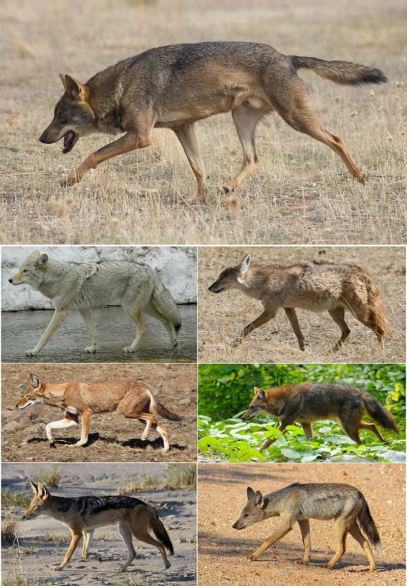

## Abstract

We can use markdown syntax to *italicize* or **bold** or ~~strikethrough~~ text. Since Markdown doesn't include small-caps functionality, we can still use \LaTeX functionality to \textsc{write in small caps}.

## Introduction




However, there are some limits to markdown- for example, we can't resize the figure to make it larger. We can always turn to \LaTeX code to specify options for the image:

\begin{figure}[t]
\label{fig:pop}
\includegraphics[width=15cm,height=15cm,keepaspectratio]{Pictures/Siberian_Husky.png}
\centering
\caption{Here are different Canis Species}
\end{figure}

\clearpage

## Methods 


```{r,echo=FALSE,message=FALSE,warning=FALSE}
require(knitr)
# Set so that long lines in R will be wrapped:
opts_chunk$set(tidy.opts=list(width.cutoff=40),tidy=TRUE)

```

## Figure 1 - Map: Fossil Records Canidae
```{r, echo = T, eval = F}

library(ggplot2)
canis_lnglat <- read.csv("~/Desktop/eeb-177/eeb-174-final-project/formatted-Canis_Occurences_lnglat_noheader.csv",header = F, as.is = T)#grab the .csv data 
colnames(canis_lnglat)<-c("species","accepted_rank","max_ma","min_ma","lng","lat")
# what the data columns are 
#define what is in the data 
head(canis_lnglat)

# first of all we needed to import a world map
library(ggplot2)
library(maps)

world_map <- map_data("world")

#make a base plot with gpplot2
p <- ggplot() + coord_fixed(ratio = 1) + xlab("") + ylab("")


#Add map to base plot
base_world_version1<- p + geom_polygon(data=world_map, aes(x=long, y=lat, group=group), colour="green ", fill="green")

# overlay lng and lat on base_map
map_data1 <- base_world_version1 + geom_point(data=canis_lnglat,aes(x=lng, y=lat), colour="Red",pch=2, size=0.1, alpha=I(1)) + labs(title = "Map: Fossil Records Canidae", x = "Longitude", y = "Latitude") + theme(plot.title = element_text(hjust = 0.5, size=20, face = "bold"),   axis.title =element_text(size=12))


# INSERT MAP

map_data1

```

## Figure 2: Number of Species
```{r, echo = T, eval = F}

library(dplyr)
library(ggplot2)

## Assuming the data is in the file 'Types.csv'
canis_dat <- read.csv("~/Desktop/eeb-177/eeb-174-final-project/Canis_Occurances_725_header.csv", header = TRUE)

canis_dat_summary <-
    canis_dat                   %>% # Pipe df into group_by
    group_by(accepted_name)              %>% # grouping by 'type' column
    summarise(name_count = n())     # calculate the name count for each group
## 'canis_dat_summary' now contains the summary data for each 'type'
canis_dat_summary


### Two ways to plot using ggplot

## (1) Plot pre summarized data: 'canis_dat_summary'.
ggplot(canis_dat_summary, aes(accepted_name, name_count)) +
geom_bar(stat = 'identity') + # stat='identity' is used for summarized data.
#coord_flip(xlim = NULL) 
coord_flip(expand = TRUE)
#coord_flip(ylim = NULL)

```

## Figure 3: Early Interval of Canidae Species
```{r,echo = T, eval = F}
library(dplyr)
library(ggplot2)

## Assuming the data is in the file 'Types.csv'
early_interval_dat <- read.csv("~/Desktop/eeb-177/eeb-174-final-project/Canis_Occurances_725_header.csv", header = TRUE)

early_interval_dat_summary <-
    canis_dat                   %>% # Pipe df into group_by
    group_by(early_interval)              %>% # grouping by 'type' column
    summarise(name_count = n())     # calculate the name count for each group
## 'canis_dat_summary' now contains the summary data for each 'type'
# early_interval_dat_summary


### Two ways to plot using ggplot

## (1) Plot pre summarized data: 'canis_dat_summary'.
ggplot(early_interval_dat_summary, aes(early_interval, name_count )) +
geom_bar(stat = 'identity')  + # stat='identity' is used for summarized data.
coord_flip(expand = TRUE) 

```

## Figure 4: Canidae Fossil Occurences
```{r,echo = T, eval = F}
library(forcats)
library(ggplot2)
canis <- read.csv("~/Desktop/eeb-177/eeb-174-final-project/formatted-Canis_Occurances_genusspeciesMinMax", header = F, as.is = T) #grab the .csv data
names(canis) <- c("genus","species", "minage", "maxage") # what the data columns are

# plot the graph of y = species, x = ma ago , genus colored )
canis_occ <- ggplot(canis, aes( species, ymin = maxage, ymax=minage, colour = genus)) 
canis_occ <- canis_occ + geom_linerange(aes(ymin = minage, ymax = maxage))+ theme(legend.position="none") + coord_flip()+  theme(axis.text.y = element_text(size=10))+ theme(axis.ticks.y=element_blank()) + scale_y_continuous(limits=c(0, 25), expand = c(0, 0), breaks=c(0, 5, 10, 15, 20, 25)) + labs(title = "Canidae Fossil Occurrences", x = "Species", y = "Ma ago") + theme(plot.title = element_text(hjust = 0.5, size=18, face = "bold"), axis.title =element_text(size=20))


canis_occ
```
## Figure 5: Canidae Diversity through Time 
```{r,echo = T, eval = F}
library(tidyr)
library(dplyr)
# creating a diversity charge 
diversity <- canis %>% gather(key = type, value = age, minage, maxage) %>% mutate(count = ifelse(type == "maxage",1, -1)) %>% group_by(age) %>% summarise(count = sum(count))  %>% arrange(age,count) %>% mutate(diversity = cumsum(count)) 

#plot diversity v age
#adding lables
canis_div <- ggplot(diversity, aes(x = age, y = diversity)) + geom_step() + labs(title = "Canidae Diversity through Time")+ theme(plot.title = element_text(hjust = 0.5, size=18, face = "bold"), axis.title =element_text(size=16)) 
canis_div
```


## Figure 6: PyRate R script (in shell)
```{r,echo=TRUE, eval=F}

#! /bin/bash

# Script to run full pyrate pipeline on Canidae


# download the data
wget -O canis_occ.csv "https://paleobiodb.org/data1.2/occs/list.csv?base_name=Canidae&show=acconly"

# use the R script we had created to format the data into a pyrate-friendly file
# NOTE!
# if the output files from the R script already exist in the working directory, 
# THIS STEP WILL NOT WORK!
# The existent files are NOT overwritten!
Rscript process_canis_data.R

# Verify that the data formatting worked, and redirect the output into a file called 
# data_summary.txt so that it may be inspected later.
python ~/PyRate/PyRate.py canis_occ_PyRate.py -data_info > data_summary.txt

# And then, run PyRate!
python ~/PyRate/PyRate.py canis_occ_PyRate.py -n 1000000

```
## Results

\begin{figure}[t]
\label{fig:pop}
\includegraphics[width=15cm,height=15cm,keepaspectratio]{Pictures/Canidae_Fossil_Occurences_v2.jpeg}
\centering
\caption{Map: Fossil Records Canidae}
\end{figure}
\clearpage

\begin{figure}[t]
\label{fig:pop}
\includegraphics[width=15cm,height=15cm,keepaspectratio]{Pictures/Genus_Species.png}
\centering
\caption{Number of Species}
\end{figure}
\clearpage

\begin{figure}[t]
\label{fig:pop}
\includegraphics[width=15cm,height=15cm,keepaspectratio]{Pictures/Early_Interval.png}
\centering
\caption{Early Interval of Canidae Species}
\end{figure}
\clearpage

\begin{figure}[t]
\label{fig:pop}
\includegraphics[width=15cm,height=15cm,keepaspectratio]{Pictures/Canidae_Fossil_Occurences_v2.jpeg}
\centering
\caption{Canidae Fossil Occurences}
\end{figure}
\clearpage

\begin{figure}[t]
\label{fig:pop}
\includegraphics[width=15cm,height=15cm,keepaspectratio]{Pictures/Canidae_DiversitythroughTime.png}
\centering
\caption{Canidae Diversity through Time}
\end{figure}
\clearpage

\begin{figure}[t]
\label{fig:pop}
\includegraphics[width=15cm,height=15cm,keepaspectratio]{Pictures/Siberian_Husky.png}
\centering
\caption{PyRate R script (in shell)}
\end{figure}
\clearpage

\begin{figure}[t]
\label{fig:pop}
\includegraphics[width=15cm,height=15cm,keepaspectratio]{Pictures/Siberian_Husky.png}
\centering
\caption{PyRate R script (in shell)}
\end{figure}
\clearpage

\begin{figure}[t]
\label{fig:pop}
\includegraphics[width=15cm,height=15cm,keepaspectratio]{Pictures/Siberian_Husky.png}
\centering
\caption{PyRate R script (in shell)}
\end{figure}
\clearpage


## Discussion 

Insert Discussion

## Conclusion 

Insert Conclusion 


## Citing documents 

In this RMarkdown+\LaTeX world, citing documents becomes super easy. We have included the following lines in the `YAML` header:

```
bibliography: biblio-1.bib     
csl: ecology-letters.csl
```

The first line here tells the software that knits our document that the bibiolography for the document is stored in `biblio-1.bib`; the second line tells the software that a style-guide that describes exactly how we want our references formatted is saved at `ecology-letters-1.csl`. **Note**: You can download the style sheet for your journal of choice from [this repository of style sheets](https://www.zotero.org/styles)\footnote{https://www.zotero.org/styles}.

Let's quickly inspect the contents of the files `biblio-1.bib`, which contains the BibTeX formatted citations for the Cooney et al. paper that we have used as a source for beak morphology data and for PyRate. **NOTE** also that we are using the `system()` function in `R` to execute shell commands from `R`- you may find this handy later on!

```{r, echo = T, eval = T}
system("cat biblio-1.bib", intern = T)
```


\clearpage

## References

